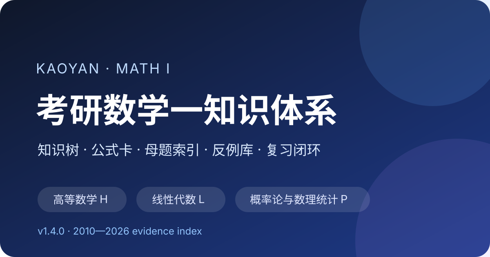

# 考研数学一知识体系

> 从“知道章节名称”升级到“能识别题型、调用方法、检查条件、追踪错因”的长期复习项目。

## 当前内容

-   **321 个三级检查项**

    把大章节拆成可打勾、可回测的最小学习任务。

-   **212 张公式卡**

    每条同时记录触发条件、记忆方式和失效边界。

-   **68 类母题**

    强调看到题目后的“第一动作”，便于真题归档。

-   **40 张反例卡**

    专门修复“结论记住了、条件却忘了”的选择题失分。

-   **本地掌握图谱**

    用版本化 Schema 记录个人训练，并自动生成薄弱节点、复测和周报；数据不进入公开仓库。

-   **385 题真题证据**

    以去题面化元数据连接 2010—2026 年份、母题、节点和错因；模拟卷仅作匿名聚合。

## 建议阅读顺序

1. 先看[体系总览](00-overview.md)，理解编号、优先级和掌握等级。
2. 按高数、线代、概率统计三个主模块推进。
3. 学完一个章节后，用[三级检查清单](06-checklists.md)验收。
4. 做题时把题目挂到[母题索引](11-problem-archetypes.md)，把错误挂到[反例库](12-counterexamples.md)。
5. 每周使用[复习闭环与记录模板](05-maintenance-loop.md)更新掌握状态。
6. 需要数字化追踪时，使用[本地掌握图谱与自动复盘](15-local-data.md)，不要把个人记录提交到 Git。
7. 需要按年份、母题或节点反查时，打开[真题证据索引](16-exam-evidence-index.md)。

## 获取完整文件

- 单文件 Markdown：在仓库根目录运行 `python scripts/build_bundle.py`。
- Word、PDF 与发布压缩包：前往项目的 GitHub Releases 页面。
- 构建与发布说明：[下载与构建](downloads/README.md)。

!!! note "正式备考"
    本项目用于组织知识与复盘错题。考试范围、题型和要求以报考年度正式发布的考试大纲为准。
